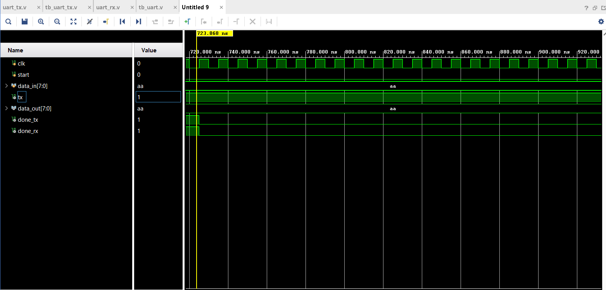

# UART Communication System in Verilog

## Overview
This project implements a complete UART communication system including both Transmitter (TX) and Receiver (RX) using Verilog HDL.

## Features
- UART Transmitter (start, 8-bit data, stop)
- UART Receiver with mid-bit sampling
- Synchronization for reliable reception
- End-to-end communication (TX → RX)

## Design Details
- FSM-based design
- Baud rate control using clock divider
- RX uses edge detection and center sampling

## Simulation
- Tool: Xilinx Vivado
- Verified by connecting TX output directly to RX input
- Successfully reconstructed transmitted data

## Result
Input Data  : 0xAA  
Received Data: 0xAA  
## waveform

## Concepts Learned
- Serial communication (UART)
- FSM design
- Timing and sampling accuracy
- Signal synchronization

## Author
Mohd Ehsan Muzammil 
